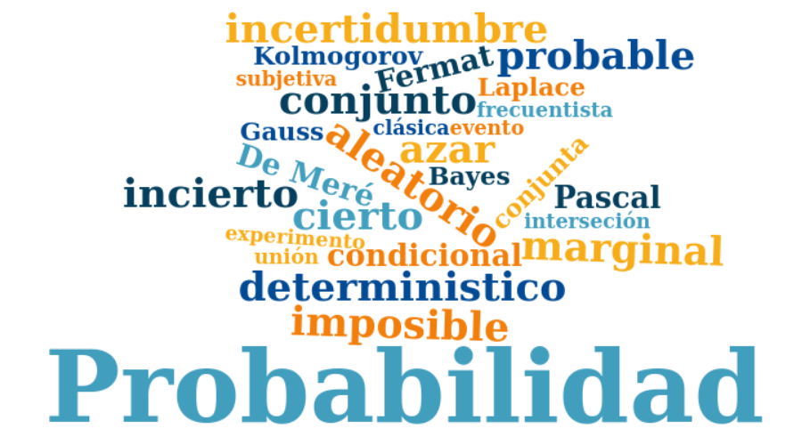
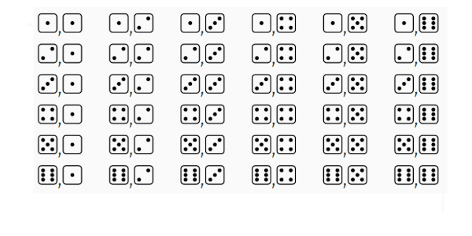

```{r, echo=FALSE, out.width="50%", fig.align = "center"}

```
<br/> <br/>

Hablar de probabilidad reune una serie de conceptos algunos de los cuales se presentan en la nube de palabras. A continuación se definen los más importantes :

<br/><br/><br/>

### **Experimento aleatorio**

<br/>

Acción que puede ser replicada bajo las mismas condiciones y cuyo resultado no se conoce por anticipado.

+ $E_{1}$: Lanzar una moneda dos veces y observar los resultados obtenidos en sus caras superiores 

+ $E_{2}$: Lanzar dos dados y observar la suma de los resultados superiores 

+ $E_{3}$: Realizar un examen de estadística y observar el resultado obtenido  

+ $E_{4}$: En una salida de campo, observo si se cumple o no, totalmente el objetivo planteado 

+ $E_{5}$: Observo el número total de ensayos de laboratorio exitosos en  20 intentos realizados.


<br/><br/><br/>

### **Espacio muestral** 

<br/>

Conjunto de todos los posibles valores que puede tomar el experimento aleatorio. Este conjunto se nombra conuna letra mayuscula $S$ o tambien con **$\Omega$**

+ $S_{1}$= $\{ (cc), (cs), (sc), (ss) \}$  

<br/>

:::: {style="display: flex;"}

::: {}

+ $\begin{equation*}
	S_{2}=\left\{
	\begin{array}{cccccc}
	&(1,1),(1,2),(1,3),(1,4),(1,5),(1,6)&\\
	&(2,1),(2,2),(2,3),(2,4),(2,5),(2,6)&\\
	&(3,1),(3,2),(3,3),(3,4),(3,5),(3,6)&\\
	&(4,1),(4,2),(4,3),(4,4),(4,5),(4,6)&\\
	&(5,1),(5,2),(5,3),(5,4),(5,5),(5,6)&\\
	&(6,1),(6,2),(6,3),(6,4),(6,5),(6,6)&
	\end{array}
	\right\}
	\end{equation*}$ 

:::

::: {}

```{r, echo=FALSE, out.width="60%", fig.align = "center"}

```
:::

::::

<br/><br/>

+ $S_{3}$= $\{ x \in \mathbb{R} | 0 \leq x \leq 5   \}$ 

<br/>

+ $S_{4}$= $\{ x \in \mathbb{N}| 0 \leq x \leq 1 \}$ 

<br/>

+ $S_{5}$= $\{ x \in \mathbb{N}| 0 \leq x \leq 20 \}$

<br/><br/>

Algunos de los conjuntos se definen por extensión  ($S_{1}$, $S_{2}$ )y otros por compresión ($S_{3}$, $S_{4}$ y $S_{5}$)

<br/><br/><br/>

### **Evento aleatorio**

<br/>

Subconjunto del espacio muestral que es de nuestro interés. Como todo conjunto se nombra con una letra mayúscula por lo general las primeras letras del alfabeto


|           |                                       |                      |
|:----------|:--------------------------------------|:---------------------|
|$A_{1}$    | Obtener solo caras                    | $A_{1}=\{ (c,c)\}$
| $A_{2}$   | Sacar un resultados es inferior a 4   | $A_{2}=\{(1,1),(1,2)(2,1)\}$
| $A_{3}$   | Ganar el examen                       | $A_{3}=\{ x \in \mathbb{R} | 3.0 \leq x \leq 5.0 \}$
| $A_{4}$   | Cumplir el objetivo de la salida      | $A_{4} =\{ 1 \}$
| $A_{5}$   | Obtener más de 5 ensayos éxitos       | $A_{5}$= $\{ x \in \mathbb{N}| 6 \leq x \leq 20 \}$

<br/><br/>


<br/><br/><br/>

## **Enfoques de probabilidad**

<br/><br/><br/>

### **Enfoque clásico**  

<br/>

Es el enfoque más antiguo de probabilidad y que está basado en el supuesto de eventos individuales igualmente probables. La probabilidad bajo ese enfoque para el evento $A$ se calcula como la fracción entre el número de elementos del conjunto $A$, $n(A)$ y el número de elementos del espacio muestral $n(S)$: 
		

$$P(A)=\dfrac{n(A)}{n(S)}$$
<br/><br/><br/>

### **Enfoque Frecuentista**

<br/>

Este enfoque basa su cálculo en la frecuencia con que ocurre un evento en un tamaño de muestra determinado $n$.

			
$$\lim_{n \to{+}\infty} P(A)=\Bigg[ \dfrac{\text{número de veces que ocurre A}}{n} \Bigg]$$
<br/><br/><br/>

### **Enfoque subjetivo** 

<br/>

En este caso la probabilidad es valorada y asignada por un **EXPERTO**, como un médico, un ingeniero, un abogado, un economista, un biólogo, un estadístico ......


