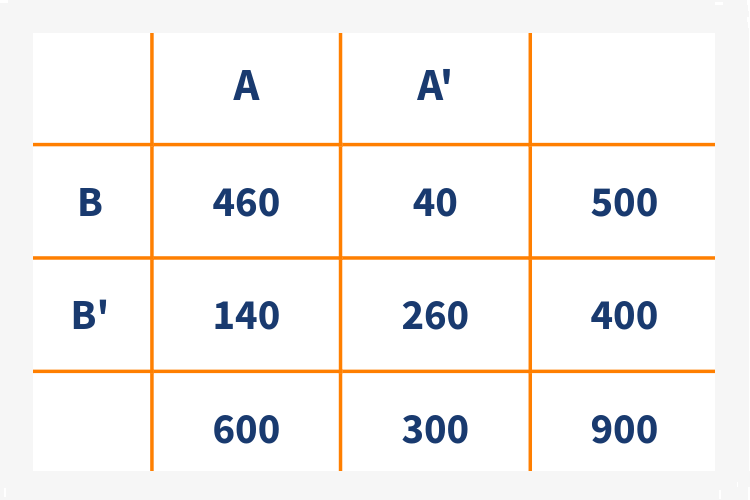
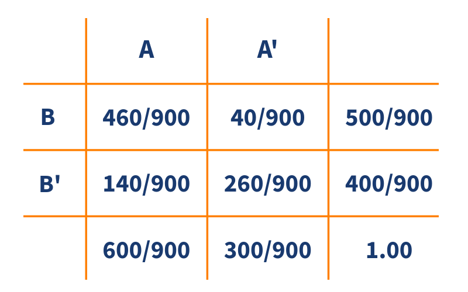

```{r setup, include=FALSE}
knitr::opts_chunk$set(echo = TRUE)
```


Iniciaremos con una tabla cruzada o de doble entrada que representa los valores obtenidos para dos caracteristicas cualitativas **A** y **B** para 900 registros 

```{r, echo=FALSE, out.width="35%", fig.align = "center"}

```

<br/><br/>

A partir de estos valores se obtienen probabilidades bajo el enfoque frecuentista

```{r, echo=FALSE, out.width="40%", fig.align = "center"}

```

<br/><br/><br/>

#### **Probabilidad marginal o simple**

Corresponde a la probabilidad de que ocurra un evento simple. Tambien se le llama marginal debido a que aparece en el margen de las tablas o totales por fila o por columna

<br/>

* $P(A) = 600/900 = 0.667$ : probabilidad de que ocurra $A$

* $P(A') = 300/900 = 0.333$ : probabilidad de que no ocurra $A$

* $P(B) = 500/900 = 0.556$ : probabilidad de que ocurra $B$

* $P(B') = 400/900 = 0.444$ : probabilidad de que no ocurra $B$


<br/><br/><br/>

#### **Probabilidad conjunta**

Esta probabilidad ocurre cuando los dos eventos ocurren a la vez al mismo tiempo

<br/>

* $P(A \cap B) = 460/900 = 0.511$ : probabilidad de que ocurra A y B 
			
* $P(A' \cap B) = 40/900 = 0.044$ : probabilidad de que NO ocurra A y ocurra B 

* $P(A \cap B') = 140/900 = 0.156$ : probabilidad de que ocurra A y NO ocurra B 

* $P(A' \cap B') = 260/900 = 0.289$ : probabilidad de que NO ocurra A ni B 

<br/><br/><br/>

#### **Probabilidad condicional**

<br/>

En la mayoria de los casos cuando queremos calcualar una probabilidad conocemos eventos que los afectan. La probabilidades que toman información sobre la ocurrencia o no de eventos relacionados se les conoce como probabilidades condicionales


La probabilidad condicional de $B$, dado $A$, se denota como $P(B|A)$, se define como:

$$P(B|A)=\dfrac{P(A \cap B)}{P(A)}$$


```{r, echo=FALSE, out.width="50%", fig.align = "center"}
knitr::include_graphics("img/arbol1_22.png")
```


* $P(B|A)=\dfrac{P(A \cap B)}{P(A)} = \dfrac{460/900}{600/900} = \dfrac{460}{600} = 0.767$

La probabilidad de que ocurra $B$ dado que ya sucedió $A$ es de 0.767