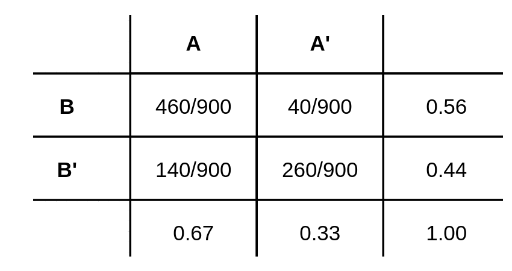

```{r setup, include=FALSE}
knitr::opts_chunk$set(echo = TRUE, comment = NA)

# install.packages("devtools") # solo una vez
#devtools::install_github("dgonxalex80/paqueteNIV") # descarga paqueteDEG
library(paqueteNIV) # activa paqueteDEG


```

<br/><br/>

### <span style="color:#FF7F00"> **Ejemplo**</span> 

Iniciaremos con una tabla cruzada o de doble entrada que representa los valores obtenidos para dos características cualitativas **A** y **B** para 900 registros 

<br/><br/>

<center>
**Tabla 2.1**  Distribución de las frecuencias absolutas de **A** y **B**  
</center>
```{r, echo=FALSE, out.width="50%", fig.align = "center"}
knitr::include_graphics("img/tabla2_22a.png")
```


```{r}
# se crea la tabla 
x=c(460,140,40,260)
t=matrix(x,nrow=2)
colnames(t)=c("A","A'")
rownames(t)=c("B","B'")
addmargins(t)

```


<br/><br/>

A partir de estos valores se obtienen probabilidades bajo el **enfoque frecuentista**

<br/><br/>


<center>
**Tabla 2.2** Distribución frecuencias relativas de **A** y **B**  
</center>
```{r, echo=FALSE, out.width="50%", fig.align = "center"}

```


<br/><br/><br/>

### <span style="color:#034a94">**Probabilidad marginal o simple**</span>

Corresponde a la probabilidad de que ocurra un evento simple. También se le llama marginal debido a que aparece en el margen de las tablas o totales por fila o por columna

<br/>

* $P(A) = 600/900 = 0.667$ : probabilidad de que ocurra $A$

* $P(A') = 300/900 = 0.333$ : probabilidad de que no ocurra $A$

* $P(B) = 500/900 = 0.556$ : probabilidad de que ocurra $B$

* $P(B') = 400/900 = 0.444$ : probabilidad de que no ocurra $B$


<br/><br/><br/>

### <span style="color:#034a94">**Probabilidad conjunta**</span>

Esta probabilidad ocurre cuando los dos eventos ocurren a la vez al mismo tiempo

<br/>

* $P(A \cap B) = 460/900 = 0.511$ : probabilidad de que ocurra $A$ y $B$ 

* $P(A' \cap B) = 40/900 = 0.044$ : probabilidad de que NO ocurra $A$ y ocurra $B$ 

* $P(A \cap B') = 140/900 = 0.156$ : probabilidad de que ocurra $A$ y NO ocurra $B$ 

* $P(A' \cap B') = 260/900 = 0.289$ : probabilidad de que NO ocurra $A$ ni $B$ 

<br/><br/><br/>

###  <span style="color:#034a94">**Probabilidad condicional**</span>

<br/>

En la mayoría de los casos cuando queremos calcular una probabilidad conocemos eventos que los afectan. A las probabilidades que toman información sobre la ocurrencia o no de eventos relacionados se les conoce como probabilidades condicionales.


<div class="content-box-blue">
La probabilidad condicional de $B$, dado $A$, se denota como $P(B|A)$, se define como:

$$P(B|A)=\dfrac{P(A \cap B)}{P(A)}$$
</div>

<center>
  
```{r, echo=FALSE, out.width="80%", fig.align = "center"}
knitr::include_graphics("img/arbol1_22.png")
```
</br>
**Figura 2.2** Arbol de probabilidades
</center>

<br/><br/>

* $P(B|A)=\dfrac{P(A \cap B)}{P(A)} = \dfrac{460/900}{600/900} = \dfrac{460}{600} = 0.767$

<br/>

La probabilidad de que ocurra $B$ dado que ya sucedió $A$ es de 0.767

<br/><br/><br/>


### <span style="color:#034a94">**Independencia de eventos**</span>

<br/>

En el caso que se requiera evaluar si dos eventos son independientes o no, partiendo de la definición de probabilidad condicional se podría obtener la siguiente regla al despejar $P(A \cap B)$ de la ecuación para obtener : $P(A \cap B) = P(A)∗P(B|A)$. En caso de que la ocurrencia del evento $A$ previamente al evento $B$, no cambie su probabilidad, se podría escribir que $P(B|A)=P(B)$ y en este caso la regla indica que la probabilidad conjunta de los eventos $A$ y $B$ es igual a la probabilidad de sus probabilidades marginales :

<br/><br/>

<div class="content-box-blue">
Dos eventos $A$ y $B$ son independientes si y solo si la probabilidad del evento $B$ no es afectada por la ocurrencia del evento A o viceversa.

$$P(B|A) = \dfrac{P( A \cap B)}{P(A)} = P(B)$$ 

$$P(A∩B)= P(A) \hspace{.2cm} P(B|A) = P(A) \hspace{.2cm} P(B)$$   


</div>

<br/><br/><br/>

### <span style="color:#034a94">**Probabilidad total**</span>

<br/>

Para explicar el concepto de probabilidad total, supongamos que el espacio muestral está formado por elementos que pueden ser representados por una partición del conjunto $S$. Para este ejemplo con 5 particiones ($A_{1}$, $A_{2}$, $A_{3}$, $A_{4}$ y $A_{5}$).   Sobre este espacio se define un evento aleatorio $B$ 


<center>
```{r, echo=FALSE, out.width="100%", fig.align = "center"}
knitr::include_graphics("img/particion2_1122.png")
```
</br>

**Figura 2.2** Partición del espacio muestral
</center>


</br></br>

Se puede resaltar los conjutos que conforman el evento $B$


<center>
```{r, echo=FALSE, out.width="100%", fig.align = "center"}

```
</br>
**Figura 2.3** Evento B como la unión de intercepciones $A_{i} \cap B$
</center>

<br/><br/>

Tambien podemos recostruir $B$ como :

$B = (A_{1} \cap B) \cup (A_{2} \cap B) \cup (A_{3} \cap B) \cup (A_{4} \cap B) \cup (A_{5} \cap B)$

<br/><br/>

En términos de probabilidad  tenemos

$P(B) = P(A_{1} \cap B) + P(A_{2} \cap B) + P(A_{3} \cap B) + P(A_{4} \cap B) + P(A_{5} \cap B)$

Este resultado se puede expresar en otros términos de la regla de la multiplicación:

$P(B) = P(A_{1})P(B|A_{1}) + P(A_{2})P(B|A_{2})  +P(A_{3})P(B|A_{})  + P(A_{4})P(B|A_{4}) + P(A_{5})P(B|A_{5})$

<br/><br/><br/>
Definimos la probabilidad total de manera general:

<div class="content-box-blue">
Dado una serie de eventos que conforman una partición $E_{1}$, $E_{2}$, $E_{3}$, $\dots$, $E_{k}$, que son mutuamente excluyentes y exhaustivos y un evento $A$, la probabilidad del evento $A$ se expresa como :

$$P(A)=P(E_{1})P(A|E_{1})+ P(E_{2})P(A|E_{2})+ P(E_{3})P(A|E_{3})+ \dots P(E_{k})P(A|E_{k})$$
</div>

<br/><br/><br/>

### <span style="color:#034a94">**Teorema de Bayes**</span>

El **teorema de Bayes**, fue propuesto por  el matemático británico Thomas Bayes, es una relación que permite determinar la probabilidad condicional. La probabilidad condicional es la probabilidad de que ocurra un resultado, basado en un resultado previo. El **teorema de Bayes** permite ajustar las probabilidades dada nueva información.

<div class="content-box-blue">
Dado una serie de eventos que conforma una partición $E_{1}$, $E_{2}$, $E_{3}$, $\dots$, $E_{k}$ , que son mutuamente excluyentes y exhaustivos, con probabilidad a priori $P(E_{1})$, $P(E_{2})$ $P(E_{3})$, $\dots$, $P(E_{k})$. Si ocurre un evento $A$, la probabilidad a posteriori de $E_{i}$ dados $A$, es la probabilidad condicional :

$$P(E_{i}|A)=\dfrac{P(E_{i} \cap A)}{P(A)}= \dfrac{P(E_{i}) P(A|E_{i})}{\displaystyle\sum_{j=1}^{k} P(E_{j})P(A|E_{j})} $$
</div>


<br/><br/><br/>

### <span style="color:#034a94">**Código R**</span>

<br/>

Construcción de la tabla

```{r}
# se crea la tabla 
x=c(460,140,40,260)
t=matrix(x,nrow=2)
rownames(t)=c("A","A'")
colnames(t)=c("B","B'")
t
```

<br/><br/>

Se adicionan los totales 

```{r}
# adiciona los totales por filas y por columnas
addmargins(t)
```

<br/><br/>

Se calculan las probabilidades conjuntas

```{r}
# probabilidades conjuntas
prop.table(t)
```


<br/><br/>

Se calculan las probabilidades marginales por filas

```{r}
# probabilidades condicionales por fila
prop.table(t,1)
```


<br/><br/>

Se calculan las probabilidades marginales por columnas

```{r}
# probabilidades condiccionales por columna
prop.table(t,2)
```


<br/><br/>

### <span style="color:#034a94">**Aplicación**</span>

<br/>

Podemos representar las probabilidades mediante un árbol. Como ejemplo tomamos la base de datos del titanic contenida en el paquete `titanic` y calculamos la probabilidad de que un pasajero sobreviviera teniendo en cuenta su sexo.

<center>
```{r, message=FALSE}
# install.packages("rpart")
# install.packages("rattle")
#install.packages("rpart.plot")
library(readr)
library(rpart)
library(rattle)
library(rpart.plot)
library(paqueteNIV)
data("titanic3")

sobrevive.model <- rpart(survived ~ ., data = ptitanic, cp = .02)
rpart.plot(sobrevive.model,
           main = "Árbol de sobrevivientes Titanic")

```
</br>
**Figura 2.4** Árbol de probabilidades
</center>

<br/><br/>

En el primer nivel de información hace referencia a la probabilidad de sobrevivir (0.38)

```{r}
t=table(titanic3$survived)
prop.table(t)
```

* $P(\text{survived} = 1) = 0.381971$ : probabilidad de sobrevivir en un accidente similar

* $P(\text{survived} = 0) = 0.618029$ : probabilidad de no sobrevivir en un acdidente similar

<br/><br/>

En el segundo nivel se representan las probabilidades condicionales a partir de conocer que el pasajero sobrevivió, con relación al sexo . 

<br/>

```{r}
t2=table(titanic3$survived,titanic3$sex)
prop.table(t2,2)
```

<br/>

* $P(\text{female}|\text{survived}) = 0.72746778$ : si conocemos que sobrevivió, la probabilidad de que sea una mujer

* $P(\text{male}|\text{survived}) = 0.1909846$ : si se conoce que sobrevivió, la probabilidad de que sea hombre 

<br/><br/>

El árbol presenta las probabilidades condicionales a medida que se desagregan las ramas


